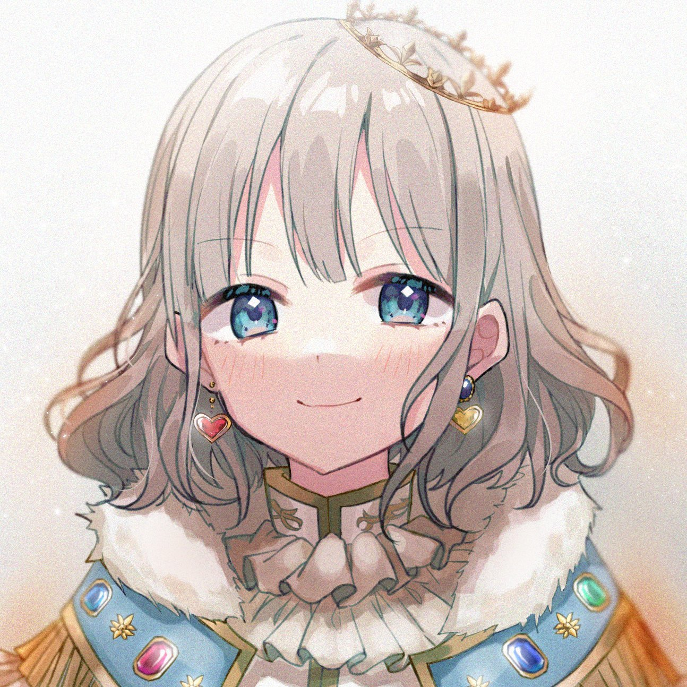

<h1 align="center">

 </h1>
<h1 align="center">
Tsune Bot Discord
</h1>

## Sobre

Tsune é um bot em desenvolvimento com o objetivo de gerenciar o controle de edições de imagens feitas pelos editores da scan <a href="https://tsundokutraducoes.com.br/">  Tsundoku  </a>, que adota um sistema de gameficação para incentivar seus editores.

## Comandos e Eventos

 - [ ] Competição
	 - [x] Registrar novas imagens
	 - [x] Cadastrar editor
	 - [x] Atribuir pontos por imagens editadas
	 - [x] Retirar imagem por desistência 
	 - [x] Vincular imagem ao editor via reação de mensagem 
	 - [x] Notificação privada para adms
	 - [ ] Aviso de tempo máximo para entrega acabando
- [x] Social
	- [x] Comando de ajuda
	- [x] Lista de comandos
	- [x] Mensagem de teste
- [ ] Administrativas
	- [ ] Kick
	- [ ] Ban
	- [ ] Mute
	- [ ] Adicionar Role/Tag
	- [ ] Apagar mensagens
## Tecnologias
- [NodeJS](https://nodejs.dev/)
- [MongoDB](https://www.mongodb.com/)
- [DiscordJS](https://discord.js.org/#/)
- [Axios](https://axios-http.com/docs/intro)

